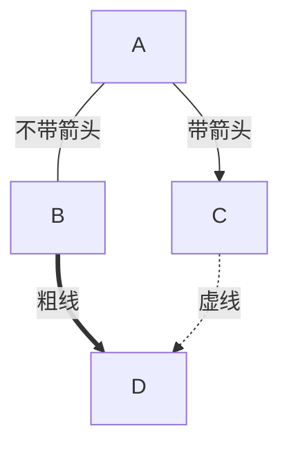

## GoAT（Go ASCII Tool）

这个是  新增的功能 —— **原生**支持渲染 [GoAT](https://github.com/blampe/goat) 代码块：

> 「原生」的意思就是「天然的」：天然就可以，无需其他改动。\
> 只要你使用的 Hugo 版本在 `^0.93.0` 及以上，你就可以「直接」用上这个功能。

<pre>
```goat
           .-.           .-.           .-.           .-.           .-.           .-.
          |   |         |   |         |   |         |   |         |   |         |   |
       .---------.   .--+---+--.   .--+---+--.   .--|   |--.   .--+   +--.   .------|--.
      |           | |           | |   |   |   | |   |   |   | |           | |   |   |   |
       '---------'   '--+---+--'   '--+---+--'   '--|   |--'   '--+   +--'   '--|------'
          |   |         |   |         |   |         |   |         |   |         |   |
           '-'           '-'           '-'           '-'           '-'           '-'
```
</pre>

```goat
           .-.           .-.           .-.           .-.           .-.           .-.
          |   |         |   |         |   |         |   |         |   |         |   |
       .---------.   .--+---+--.   .--+---+--.   .--|   |--.   .--+   +--.   .------|--.
      |           | |           | |   |   |   | |   |   |   | |           | |   |   |   |
       '---------'   '--+---+--'   '--+---+--'   '--|   |--'   '--+   +--'   '--|------'
          |   |         |   |         |   |         |   |         |   |         |   |
           '-'           '-'           '-'           '-'           '-'           '-'
```

很炫酷吧？

> 注意 `goat` 必须是小写。别的语言标记是忽略大小写的，比如 `Python` 和 `python` 都能正常识别。\
> 但这个新功能解析的时候并没有特意处理大小写，是区分大小写的。<code>```GoAT</code> 不会渲染。

### 缺憾

但截至目前（22.4.30，最新版本 `0.98.0`）为止，这个功能还不怎么完善。

众所周知，各种博客程序支持 Markdown 标记语言的代码块实现大致相同。都是把

<pre>
```Language
# content
```
</pre>

这样的格式解析为

```HTML
<pre>
# content
</pre>
```

这样的 HTML 标签 `<pre></pre>`。\
如果的语言支持，再配合前端样式进行进一步渲染。

我看了下 [Hugo 对 GoAT 的实现](https://github.com/gohugoio/hugo/blob/master/tpl/diagrams/diagrams.go)：就是在解析过程中，把语言标记为 `goat` 的代码块 hook 下来用  这个库渲染成 SVG，再把生成的 SVG 内容填到模板的对应位置。

业务逻辑没什么问题，但实际使用上有一个我觉得比较致命的 —— 痛点吧。那就是：\
**生成的 SVG 没法指定大小。**

[官方文档](https://gohugo.io/content-management/diagrams/#file-tree) 的示例看起来很完美对不对？它 TM 是手动指定宽度的。\
<kbd>F12</kbd> 查看页面元素就知道：

- 要么 `<div class="goat svg-container w-40">` 指定容器宽度；
- 要么直接 `<svg width="300">` 指定 SVG 宽度。

那我们直接用的时候呢？\
SVG 自适应（响应式）的逻辑是自动 **撑满** 宽度。

```goat
+-------------------+                           ^                      .---.
|    A Box          |__.--.__    __.-->         |      .-.             |   |
|                   |        '--'               v     | * |<---        |   |
+-------------------+                                  '-'             |   |
                       Round                                       *---(-. |
  .-----------------.  .-------.    .----------.         .-------.     | | |
 |   Mixed Rounded  | |         |  / Diagonals  \        |   |   |     | | |
 | & Square Corners |  '--. .--'  /              \       |---+---|     '-)-'       .--------.
 '--+------------+-'  .--. |     '-------+--------'      |   |   |       |        / Search /
    |            |   |    | '---.        |               '-------'       |       '-+------'
    |<---------->|   |    |      |       v                Interior                 |     ^
    '           <---'      '----'   .-----------.              ---.     .---       v     |
 .------------------.  Diag line    | .-------. +---.              \   /           .     |
 |   if (a > b)     +---.      .--->| |       | |    | Curved line  \ /           / \    |
 |   obj->fcn()     |    \    /     | '-------' |<--'                +           /   \   |
 '------------------'     '--'      '--+--------'      .--. .--.     |  .-.     +Done?+-'
    .---+-----.                        |   ^           |\ | | /|  .--+ |   |     \   /
    |   |     | Join        \|/        |   | Curved    | \| |/ | |    \    |      \ /
    |   |     +---->  o    --o--        '-'  Vertical  '--' '--'  '--  '--'        +  .---.
 <--+---+-----'       |     /|\                                                    |  | 3 |
                      v                             not:line    'quotes'        .-'   '---'
  .-.             .---+--------.            /            A || B   *bold*       |        ^
 |   |           |   Not a dot  |      <---+---<--    A dash--is not a line    v        |
  '-'             '---------+--'          /           Nor/is this.            ---
```

这样宽度拉满的还好。但如果写的是「纵向且细长」的流程图之类的呢？

<details class="collapse">
  <summary>自动撑满宽度简直是灾难</summary>

```goat
 ┌────────┐┌───────┐
 │Renderer││Browser│
 └───┬────┘└───┬───┘
     │         │
     │──┐      │
     │Message 2│
     │<────────│
     │  │      │
     │Message 1│
     │  └─────>│
     │         │
     │Message 3│
     │<────────│
     │         │
     │Message 4│
     │<────────│
     │         │
     │Message 5│
     │<────────│
     │         │
     │Message 6│
     │<────────│
     │         │
     │Message 7│
     │<────────│
     │         │
     │Message 8│
     │<────────│
     │         │
     │Message 9│
     │────────>│
 ┌───┴────┐┌───┴───┐
 │Renderer││Browser│
 └────────┘└───────┘
```

</details>

本博客还是优先阅读体验的设计（使用  主题）。\
你想想其他有些博客，文章宽度是占 80% 页面宽度的。\
你再用个三十几吋的 4K 大屏，那是一幅怎样的地狱绘卷啊。

我想了下也没什么好的解决方案，谁知道用户会写多宽多长的 ASCII 图呢？\
不撑满还能怎么办？统计 SVG 里面的最多一行字符数量也许可以？问题是怎么统计？\
SVG 里的字符都是 `font-size:1em` 适应父容器尺寸的，现在想反过来确实也不好弄。

### 用例

不过这个功能还是非常赞的，巨幅增强了博客的内容表达能力。

<details class="collapse">
  <summary>之前提到过的「细长」流程图</summary>

```goat
┌──────────┐
│    if    │
└△─┬──────┬┘
 │ │     ┌▽─────┐
 │ │     │then A│
 │ │     └┬─────┘
 │┌▽─────┐│
 ││then B││
 │└┬─────┘│
 │┌▽──────▽─┐
 ││   end   │
 │└┬────────┘
┌┴─▽─┐
│loop│
└────┘
```

</details>

```goat
   _________________
  ╱                 ╲                                                     ┌─────┐
 ╱ DO YOU UNDERSTAND ╲____________________________________________________│GOOD!│
 ╲ FLOW CHARTS?      ╱yes                                                 └──┬──┘
  ╲_________________╱                                                        │
           │no                                                               │
  _________▽_________                    ______________________              │
 ╱                   ╲                  ╱                      ╲    ┌────┐   │
╱ OKAY, YOU SEE THE   ╲________________╱ ... AND YOU CAN SEE    ╲___│GOOD│   │
╲ LINE LABELED 'YES'? ╱yes             ╲ THE ONES LABELED 'NO'? ╱yes└──┬─┘   │
 ╲___________________╱                  ╲______________________╱       │     │
           │no                                     │no                 │     │
   ________▽_________                     _________▽__________         │     │
  ╱                  ╲    ┌───────────┐  ╱                    ╲        │     │
 ╱ BUT YOU SEE THE    ╲___│WAIT, WHAT?│ ╱ BUT YOU JUST         ╲___    │     │
 ╲ ONES LABELED 'NO'? ╱yes└───────────┘ ╲ FOLLOWED THEM TWICE? ╱yes│   │     │
  ╲__________________╱                   ╲____________________╱    │   │     │
           │no                                     │no             │   │     │
       ┌───▽───┐                                   │               │   │     │
       │LISTEN.│                                   └───────┬───────┘   │     │
       └───┬───┘                                    ┌──────▽─────┐     │     │
     ┌─────▽────┐                                   │(THAT WASN'T│     │     │
     │I HATE YOU│                                   │A QUESTION) │     │     │
     └──────────┘                                   └──────┬─────┘     │     │
                                                      ┌────▽───┐       │     │
                                                      │SCREW IT│       │     │
                                                      └────┬───┘       │     │
                                                           └─────┬─────┘     │
                                                                 │           │
                                                                 └─────┬─────┘
                                                               ┌───────▽──────┐
                                                               │LET'S GO DRING│
                                                               └───────┬──────┘
                                                             ┌─────────▽─────────┐
                                                             │HEY, I SHOULD TRY  │
                                                             │INSTALLING FREEBSD!│
                                                             └───────────────────┘
```

> 至于怎么画 ASCII 图，网上一堆转换工具。实在找不到可以用 [Diagon](https://arthursonzogni.com/Diagon)。

<details class="collapse">
  <summary>横向的流程图就好多了</summary>

<pre>
```goat
                                      .
   .---------.                       / \
  |   START   |                     /   \        .-+-------+-.      ___________
   '----+----'    .-------.    A   /     \   B   | |COMPLEX| |     /           \      .-.
        |        |   END   |<-----+CHOICE +----->| |       | +--->+ PREPARATION +--->| X |
        v         '-------'        \     /       | |PROCESS| |     \___________/      '-'
    .---------.                     \   /        '-+---+---+-'
   /  INPUT  /                       \ /
  '-----+---'                         '
        |                             ^
        v                             |
  .-----------.                 .-----+-----.        .-.
  |  PROCESS  +---------------->|  PROCESS  |<------+ X |
  '-----------'                 '-----------'        '-'
```
</pre>

```goat
                                      .
   .---------.                       / \
  |   START   |                     /   \        .-+-------+-.      ___________
   '----+----'    .-------.    A   /     \   B   | |COMPLEX| |     /           \      .-.
        |        |   END   |<-----+CHOICE +----->| |       | +--->+ PREPARATION +--->| X |
        v         '-------'        \     /       | |PROCESS| |     \___________/      '-'
    .---------.                     \   /        '-+---+---+-'
   /  INPUT  /                       \ /
  '-----+---'                         '
        |                             ^
        v                             |
  .-----------.                 .-----+-----.        .-.
  |  PROCESS  +---------------->|  PROCESS  |<------+ X |
  '-----------'                 '-----------'        '-'
```

<pre>
```goat
┌───────────────────────────────┐             
│random                         │             
└┬─────────────┬─────────────┬─┬┘             
┌▽───────────┐┌▽────────────┐│┌▽─────────────┐
│distribution││seed_sequence│││nonsecure_base│
└┬───────────┘└┬───┬───────┬┘│└┬┬────────────┘
 │             │  ┌│───────│─│─│┘             
 │ ┌───────────┘  ││       │ │┌┘              
 │ │┌─────────────▽▽┐┌─────▽─▽▽┐              
 │ ││salted_seed_seq││pool_urbg│              
 │ │└┬──────────────┘└┬────────┘              
 │┌▽─▽────────────────▽┐                      
 ││seed_material       │                      
 │└┬───────────────────┘                      
┌▽─▽────┐                                     
│strings│                                     
└───────┘                                     
```
</pre>

```goat
┌───────────────────────────────┐
│random                         │
└┬─────────────┬─────────────┬─┬┘
┌▽───────────┐┌▽────────────┐│┌▽─────────────┐
│distribution││seed_sequence│││nonsecure_base│
└┬───────────┘└┬───┬───────┬┘│└┬┬────────────┘
 │             │  ┌│───────│─│─│┘
 │ ┌───────────┘  ││       │ │┌┘
 │ │┌─────────────▽▽┐┌─────▽─▽▽┐
 │ ││salted_seed_seq││pool_urbg│
 │ │└┬──────────────┘└┬────────┘
 │┌▽─▽────────────────▽┐
 ││seed_material       │
 │└┬───────────────────┘
┌▽─▽────┐
│strings│
└───────┘
```

</details>

<details class="collapse">
  <summary>本文开头提到的重叠效果</summary>

<pre>
```goat
           .-.           .-.           .-.           .-.           .-.           .-.
          |   |         |   |         |   |         |   |         |   |         |   |
       .---------.   .--+---+--.   .--+---+--.   .--|   |--.   .--+   +--.   .------|--.
      |           | |           | |   |   |   | |   |   |   | |           | |   |   |   |
       '---------'   '--+---+--'   '--+---+--'   '--|   |--'   '--+   +--'   '--|------'
          |   |         |   |         |   |         |   |         |   |         |   |
           '-'           '-'           '-'           '-'           '-'           '-'
```
</pre>

```goat
           .-.           .-.           .-.           .-.           .-.           .-.
          |   |         |   |         |   |         |   |         |   |         |   |
       .---------.   .--+---+--.   .--+---+--.   .--|   |--.   .--+   +--.   .------|--.
      |           | |           | |   |   |   | |   |   |   | |           | |   |   |   |
       '---------'   '--+---+--'   '--+---+--'   '--|   |--'   '--+   +--'   '--|------'
          |   |         |   |         |   |         |   |         |   |         |   |
           '-'           '-'           '-'           '-'           '-'           '-'
```

</details>

<details class="collapse">
  <summary>序列图</summary>

<pre>
```goat
┌─────┐       ┌───┐
│Alice│       │Bob│
└──┬──┘       └─┬─┘
   │            │  
   │ Hello Bob! │  
   │───────────>│  
   │            │  
   │Hello Alice!│  
   │<───────────│  
┌──┴──┐       ┌─┴─┐
│Alice│       │Bob│
└─────┘       └───┘
```
</pre>

```goat
┌─────┐       ┌───┐
│Alice│       │Bob│
└──┬──┘       └─┬─┘
   │            │
   │ Hello Bob! │
   │───────────>│
   │            │
   │Hello Alice!│
   │<───────────│
┌──┴──┐       ┌─┴─┐
│Alice│       │Bob│
└─────┘       └───┘
```

<pre>
```goat
 ┌────────┐            ┌───────┐     ┌───────┐
 │Renderer│            │Browser│     │Network│
 └───┬────┘            └───┬───┘     └───┬───┘
     │                     │             │    
     │  BeginNavigation()  │             │    
     │────────────────────>│             │    
     │                     │             │    
     │                     │URLRequest() │    
     │                     │────────────>│    
     │                     │             │    
     │                     │URLResponse()│    
     │                     │<────────────│    
     │                     │             │    
     │ CommitNavigation()  │             │    
     │<────────────────────│             │    
     │                     │             │    
     │DidCommitNavigation()│             │    
     │────────────────────>│             │    
 ┌───┴────┐            ┌───┴───┐     ┌───┴───┐
 │Renderer│            │Browser│     │Network│
 └────────┘            └───────┘     └───────┘
```
</pre>

```goat
 ┌────────┐            ┌───────┐     ┌───────┐
 │Renderer│            │Browser│     │Network│
 └───┬────┘            └───┬───┘     └───┬───┘
     │                     │             │
     │  BeginNavigation()  │             │
     │────────────────────>│             │
     │                     │             │
     │                     │URLRequest() │
     │                     │────────────>│
     │                     │             │
     │                     │URLResponse()│
     │                     │<────────────│
     │                     │             │
     │ CommitNavigation()  │             │
     │<────────────────────│             │
     │                     │             │
     │DidCommitNavigation()│             │
     │────────────────────>│             │
 ┌───┴────┐            ┌───┴───┐     ┌───┴───┐
 │Renderer│            │Browser│     │Network│
 └────────┘            └───────┘     └───────┘
```

</details>

<details class="collapse">
  <summary>文件树</summary>

<pre>
```goat
Linux
 ├─Android
 ├─Debian
 │  ├─Ubuntu
 │  │  ├─Lubuntu
 │  │  ├─Kubuntu
 │  │  ├─Xubuntu
 │  │  └─Xubuntu
 │  └─Mint
 ├─Centos
 └─Fedora
```
</pre>

```goat
Linux
 ├─Android
 ├─Debian
 │  ├─Ubuntu
 │  │  ├─Lubuntu
 │  │  ├─Kubuntu
 │  │  ├─Xubuntu
 │  │  └─Xubuntu
 │  └─Mint
 ├─Centos
 └─Fedora
```

<pre>
```goat
───Linux─┬─Android
         ├─Debian─┬─Ubuntu─┬─Lubuntu
         │        │        ├─Kubuntu
         │        │        ├─Xubuntu
         │        │        └─Xubuntu
         │        └─Mint
         ├─Centos
         └─Fedora
```
</pre>

```goat
───Linux─┬─Android
         ├─Debian─┬─Ubuntu─┬─Lubuntu
         │        │        ├─Kubuntu
         │        │        ├─Xubuntu
         │        │        └─Xubuntu
         │        └─Mint
         ├─Centos
         └─Fedora
```

</details>

<details class="collapse">
  <summary>树</summary>

<pre>
```goat
          .               .                .               .--- 1          .-- 1     / 1
         / \              |                |           .---+            .-+         +
        /   \         .---+---.         .--+--.        |   '--- 2      |   '-- 2   / \ 2
       +     +        |       |        |       |    ---+            ---+          +
      / \   / \     .-+-.   .-+-.     .+.     .+.      |   .--- 3      |   .-- 3   \ / 3
     /   \ /   \    |   |   |   |    |   |   |   |     '---+            '-+         +
     1   2 3   4    1   2   3   4    1   2   3   4         '--- 4          '-- 4     \ 4

```
</pre>

```goat
          .               .                .               .--- 1          .-- 1     / 1
         / \              |                |           .---+            .-+         +
        /   \         .---+---.         .--+--.        |   '--- 2      |   '-- 2   / \ 2
       +     +        |       |        |       |    ---+            ---+          +
      / \   / \     .-+-.   .-+-.     .+.     .+.      |   .--- 3      |   .-- 3   \ / 3
     /   \ /   \    |   |   |   |    |   |   |   |     '---+            '-+         +
     1   2 3   4    1   2   3   4    1   2   3   4         '--- 4          '-- 4     \ 4

```

</details>

<details class="collapse">
  <summary>数学公式</summary>

<pre>
```goat
             x  
f(x) = 1 + ─────
           1 + x
```
</pre>

```goat
             x
f(x) = 1 + ─────
           1 + x
```

<pre>
```goat
     _____________
    ╱        _____
   ╱        ╱    x
  ╱  1 +   ╱ 1 + ─
╲╱       ╲╱      2
```
</pre>

```goat
     _____________
    ╱        _____
   ╱        ╱    x
  ╱  1 +   ╱ 1 + ─
╲╱       ╲╱      2
```

<pre>
```goat
                      ⎛    1⎞
                      ⎜1 + ─⎟
            2    3    ⎝    2⎠
f(x) = 1 + x  + x  + x       
```
</pre>

```goat
                      ⎛    1⎞
                      ⎜1 + ─⎟
            2    3    ⎝    2⎠
f(x) = 1 + x  + x  + x
```

<pre>
```goat
S  = u  + u  + ... + u 
 n    1    2          n
```
</pre>

```goat
S  = u  + u  + ... + u
 n    1    2          n
```

<pre>
```goat
  n                   
 ___        3    2    
 ╲     2   n    n    n
 ╱    i  = ── + ── + ─
 ‾‾‾        2    2   6
i = 0                 
```
</pre>

```goat
  n
 ___        3    2
 ╲     2   n    n    n
 ╱    i  = ── + ── + ─
 ‾‾‾        2    2   6
i = 0
```

<pre>
```goat
1            3
⌠  2        n 
⌡ x  ⋅ dx = ──
0            3
```
</pre>

```goat
1            3
⌠  2        n
⌡ x  ⋅ dx = ──
0            3
```

<pre>
```goat
                    2    
  n        ⎛  n    ⎞     
━┳┳━   2   ⎜━┳┳━   ⎟     
 ┃┃   i  = ⎜ ┃┃   i⎟     
i = 1      ⎝i = 1  ⎠     
                         
                         
                         
 100                     
━┳━┳━ 1                  
 ┃ ┃  ─ = 7.8886091e - 31
 ┃ ┃  2                  
  1                      
```
</pre>

```goat
                    2
  n        ⎛  n    ⎞
━┳┳━   2   ⎜━┳┳━   ⎟
 ┃┃   i  = ⎜ ┃┃   i⎟
i = 1      ⎝i = 1  ⎠


 100
━┳━┳━ 1
 ┃ ┃  ─ = 7.8886091e - 31
 ┃ ┃  2
  1
```

<pre>
```goat
⎛a⎞   ⎛c⎞   ⎛a + c⎞
⎜ ⎟ + ⎜ ⎟ = ⎜     ⎟
⎝b⎠   ⎝d⎠   ⎝b + d⎠
```
</pre>

```goat
⎛a⎞   ⎛c⎞   ⎛a + c⎞
⎜ ⎟ + ⎜ ⎟ = ⎜     ⎟
⎝b⎠   ⎝d⎠   ⎝b + d⎠
```

<pre>
```goat
⎛1 2⎞   ⎛x⎞   ⎛1 ⋅ x + 2 ⋅ y⎞
⎜   ⎟ ⋅ ⎜ ⎟ = ⎜             ⎟
⎝3 4⎠   ⎝y⎠   ⎝3 ⋅ x + 4 ⋅ y⎠
```
</pre>

```goat
⎛1 2⎞   ⎛x⎞   ⎛1 ⋅ x + 2 ⋅ y⎞
⎜   ⎟ ⋅ ⎜ ⎟ = ⎜             ⎟
⎝3 4⎠   ⎝y⎠   ⎝3 ⋅ x + 4 ⋅ y⎠
```

<pre>
```goat
⎛n⎞        n!      
⎜ ⎟ = ─────────────
⎝k⎠   k! ⋅ (n - k)!
```
</pre>

```goat
⎛n⎞        n!
⎜ ⎟ = ─────────────
⎝k⎠   k! ⋅ (n - k)!
```

<pre>
```goat
                 1         
ψ = 1 + ───────────────────
                   1       
        1 + ───────────────
                     1     
            1 + ───────────
                       1   
                1 + ───────
                    1 + ...
```
</pre>

```goat
                 1
ψ = 1 + ───────────────────
                   1
        1 + ───────────────
                     1
            1 + ───────────
                       1
                1 + ───────
                    1 + ...
```

</details>

<details class="collapse">
  <summary>各种花样的箭头</summary>

<pre>
```goat
    ^
    |
<---+--->
    |
    v
```
</pre>

```goat
    ^
    |
<---+--->
    |
    v
```

<pre>
```goat
   o--o    *--o     /  /   *  o  o o o o   * * * *   o o o o   * * * *      o o o o   * * * *
   o--*    *--*    v  v   ^  ^   | | | |   | | | |    \ \ \ \   \ \ \ \    / / / /   / / / /
   o-->    *-->   *  o   /  /    o * v '   o * v '     o * v \   o * v \  o * v /   o * v /
   o---    *---
                                 ^ ^ ^ ^   . . . .   ^ ^ ^ ^   \ \ \ \      ^ ^ ^ ^   / / / /
   |  |   *  o  \  \   *  o      | | | |   | | | |    \ \ \ \   \ \ \ \    / / / /   / / / /
   v  v   ^  ^   v  v   ^  ^     o * v '   o * v '     o * v \   o * v \  o * v /   o * v /
   *  o   |  |    *  o   \  \

   <--o   <--*   <-->   <---      ---o   ---*   --->   ----      *<--   o<--   -->o   -->*
```
</pre>

```goat
   o--o    *--o     /  /   *  o  o o o o   * * * *   o o o o   * * * *      o o o o   * * * *
   o--*    *--*    v  v   ^  ^   | | | |   | | | |    \ \ \ \   \ \ \ \    / / / /   / / / /
   o-->    *-->   *  o   /  /    o * v '   o * v '     o * v \   o * v \  o * v /   o * v /
   o---    *---
                                 ^ ^ ^ ^   . . . .   ^ ^ ^ ^   \ \ \ \      ^ ^ ^ ^   / / / /
   |  |   *  o  \  \   *  o      | | | |   | | | |    \ \ \ \   \ \ \ \    / / / /   / / / /
   v  v   ^  ^   v  v   ^  ^     o * v '   o * v '     o * v \   o * v \  o * v /   o * v /
   *  o   |  |    *  o   \  \

   <--o   <--*   <-->   <---      ---o   ---*   --->   ----      *<--   o<--   -->o   -->*
```

</details>

<details class="collapse">
  <summary>以及箭头的用法</summary>

<pre>
```goat
   +-+         \     \  |  /     /
  +   +         \     v v v     /
   +-+           \ .---------. /     \ | /
                  v|         |v       vvv
   +-+         --->|         |<---  -->o<--
  |   |           ^|         |^       ^^^
   +-+           / '---------' \     / | \
                /     ^ ^ ^     \
               /     /  |  \     \
```
</pre>

```goat
   +-+         \     \  |  /     /
  +   +         \     v v v     /
   +-+           \ .---------. /     \ | /
                  v|         |v       vvv
   +-+         --->|         |<---  -->o<--
  |   |           ^|         |^       ^^^
   +-+           / '---------' \     / | \
                /     ^ ^ ^     \
               /     /  |  \     \
```

<pre>
```goat
                ________                            o        *          *   .--------------.
   *---+--.    |        |     o   o      |         ^          \        /   |  .----------.  |
       |   |    '--*   -+-    |   |      v        /            \      /    | |  <------.  | |
       |    '----->       .---(---'  --->*<---   /      .+->*<--o----'     | |          | | |
   <--'  ^  ^             |   |                 |      | |  ^    \         |  '--------'  | |
          \/        *-----'   o     |<----->|   '-----'  |__|     v         '------------'  |
          /\                                                               *---------------'
```
</pre>

```goat
                ________                            o        *          *   .--------------.
   *---+--.    |        |     o   o      |         ^          \        /   |  .----------.  |
       |   |    '--*   -+-    |   |      v        /            \      /    | |  <------.  | |
       |    '----->       .---(---'  --->*<---   /      .+->*<--o----'     | |          | | |
   <--'  ^  ^             |   |                 |      | |  ^    \         |  '--------'  | |
          \/        *-----'   o     |<----->|   '-----'  |__|     v         '------------'  |
          /\                                                               *---------------'
```

<pre>
```goat
                        A      1      2     4                        8
A         B         C   *----->o<---->o<----o-----------.            o
*-------->o<------->o                 ^     ^            |           ^
^        / ^        |                 |     |            |           |
|       v   \       v                 v     |            v           |
o----->o---->o<---->*                 o<--->*<---->o---->*---->o---->o<---->*
D      E     F      G                 3     B      5     C     6     7      D
```
</pre>

```goat
                        A      1      2     4                        8
A         B         C   *----->o<---->o<----o-----------.            o
*-------->o<------->o                 ^     ^            |           ^
^        / ^        |                 |     |            |           |
|       v   \       v                 v     |            v           |
o----->o---->o<---->*                 o<--->*<---->o---->*---->o---->o<---->*
D      E     F      G                 3     B      5     C     6     7      D
```

</details>

<details class="collapse">
  <summary>几何图形</summary>

<pre>
```goat
   .-.
  |   |
   '-'
```
</pre>

```goat
   .-.
  |   |
   '-'
```

<pre>
```goat
                               .---.                                                 __    ..
  .--.     .  .-----.           \ /   .---.                    .---.    ___    ___  |  |   | )
 /    \   / \  \   /  .-.    .   ' .  |   |   .---. .---.     |     |  /   \  |   | '--'   ''
 \    /  /   \  \ /  |   |  / \   / \ '---'  /   /   \   \    |     |  \___/  |___|    ..  __
  '--'  '-----'  '    '-'  '---' /___\      '---'     '---'    '---'                  ( | |__|
                                                                                       ''
```
</pre>

```goat
                               .---.                                                 __    ..
  .--.     .  .-----.           \ /   .---.                    .---.    ___    ___  |  |   | )
 /    \   / \  \   /  .-.    .   ' .  |   |   .---. .---.     |     |  /   \  |   | '--'   ''
 \    /  /   \  \ /  |   |  / \   / \ '---'  /   /   \   \    |     |  \___/  |___|    ..  __
  '--'  '-----'  '    '-'  '---' /___\      '---'     '---'    '---'                  ( | |__|
                                                                                       ''
```

<pre>
```goat
          .---------.   .   .-------.        .-------.   .---------.    .-----.      .----.
           \       /   / \   \       \      |         |  |         |   /       \    /      \
            \     /   /   \   \       \     |         |  |         |  /         \  |        |
             \   /   /     \   \       \    |         |  |         |  \         /  |        |
              \ /   /       \   \       \   |         |  |         |   \       /    \      /
               '   '---------'   '-------'   '-------'   '---------'    '-----'      '----'

```
</pre>

```goat
          .---------.   .   .-------.        .-------.   .---------.    .-----.      .----.
           \       /   / \   \       \      |         |  |         |   /       \    /      \
            \     /   /   \   \       \     |         |  |         |  /         \  |        |
             \   /   /     \   \       \    |         |  |         |  \         /  |        |
              \ /   /       \   \       \   |         |  |         |   \       /    \      /
               '   '---------'   '-------'   '-------'   '---------'    '-----'      '----'

```

</details>

<details class="collapse">
  <summary>箭头 + 图形就能画地图了</summary>

<pre>
```goat
   .---.       .-.        .-.       .-.                                       .-.
   | A +----->| 1 +<---->| 2 |<----+ 4 +------------------.                  | 8 |
   '---'       '-'        '+'       '-'                    |                  '-'
                           |         ^                     |                   ^
                           v         |                     v                   |
                          .-.      .-+-.        .-.      .-+-.      .-.       .+.       .---.
                         | 3 +---->| B |<----->| 5 +---->| C +---->| 6 +---->| 7 |<---->| D |
                          '-'      '---'        '-'      '---'      '-'       '-'       '---'
```
</pre>

```goat
   .---.       .-.        .-.       .-.                                       .-.
   | A +----->| 1 +<---->| 2 |<----+ 4 +------------------.                  | 8 |
   '---'       '-'        '+'       '-'                    |                  '-'
                           |         ^                     |                   ^
                           v         |                     v                   |
                          .-.      .-+-.        .-.      .-+-.      .-.       .+.       .---.
                         | 3 +---->| B |<----->| 5 +---->| C +---->| 6 +---->| 7 |<---->| D |
                          '-'      '---'        '-'      '---'      '-'       '-'       '---'
```

</details>

<details class="collapse">
  <summary>网格</summary>

<pre>
```goat
 ┌─┬─┬─┬─┬─┐  ▉▉  ▉▉  ▉▉    ⬢ ⬡ ⬡     ┌┬┬┬┬┬┬┬┬┐  ⁚⁚⁚⁚⁚⁚⁚⁚⁚⁚   ___________    +-+-+-+-+
 ├─┼─┼─┼─┼─┤    ▉▉  ▉▉     ⬢ ⬢ ⬡ ⬡    ├┼┼┼┼┼┼┼┼┤  ⁚⁚⁚⁚⁚⁚⁚⁚⁚⁚  |__|__|__|__|   +-+-+-+-+
 ├─┼─┼─┼─┼─┤  ▉▉  ▉▉  ▉▉  ⬢ ⬢ ⬢ ⬡ ⬡   ├┼┼┼┼┼┼┼┼┤  ⁚⁚⁚⁚⁚⁚⁚⁚⁚⁚  |__|__|__|__|   +-+-+-+-+
 ├─┼─┼─┼─┼─┤    ▉▉  ▉▉     ⬡ ⬡ ⬡ ⬡    ├┼┼┼┼┼┼┼┼┤  ⁚⁚⁚⁚⁚⁚⁚⁚⁚⁚  |__|__|__|__|   +-+-+-+-+
 └─┴─┴─┴─┴─┘  ▉▉  ▉▉  ▉▉    ⬡ ⬡ ⬡     └┴┴┴┴┴┴┴┴┘  ⁚⁚⁚⁚⁚⁚⁚⁚⁚⁚  |__|__|__|__|   +-+-+-+-+
```
</pre>

```goat
 ┌─┬─┬─┬─┬─┐  ▉▉  ▉▉  ▉▉    ⬢ ⬡ ⬡     ┌┬┬┬┬┬┬┬┬┐  ⁚⁚⁚⁚⁚⁚⁚⁚⁚⁚   ___________    +-+-+-+-+
 ├─┼─┼─┼─┼─┤    ▉▉  ▉▉     ⬢ ⬢ ⬡ ⬡    ├┼┼┼┼┼┼┼┼┤  ⁚⁚⁚⁚⁚⁚⁚⁚⁚⁚  |__|__|__|__|   +-+-+-+-+
 ├─┼─┼─┼─┼─┤  ▉▉  ▉▉  ▉▉  ⬢ ⬢ ⬢ ⬡ ⬡   ├┼┼┼┼┼┼┼┼┤  ⁚⁚⁚⁚⁚⁚⁚⁚⁚⁚  |__|__|__|__|   +-+-+-+-+
 ├─┼─┼─┼─┼─┤    ▉▉  ▉▉     ⬡ ⬡ ⬡ ⬡    ├┼┼┼┼┼┼┼┼┤  ⁚⁚⁚⁚⁚⁚⁚⁚⁚⁚  |__|__|__|__|   +-+-+-+-+
 └─┴─┴─┴─┴─┘  ▉▉  ▉▉  ▉▉    ⬡ ⬡ ⬡     └┴┴┴┴┴┴┴┴┘  ⁚⁚⁚⁚⁚⁚⁚⁚⁚⁚  |__|__|__|__|   +-+-+-+-+
```

<pre>
```goat
       ___     ___      .---+---+---+---+---.     .---+---+---+---.  .---.   .---.
   ___/   \___/   \     |   |   |   |   |   |    / \ / \ / \ / \ /   |   +---+   |
  /   \___/   \___/     +---+---+---+---+---+   +---+---+---+---+    +---+   +---+
  \___/ b \___/   \     |   |   | b |   |   |    \ / \a/ \b/ \ / \   |   +---+   |
  / a \___/   \___/     +---+---+---+---+---+     +---+---+---+---+  +---+ b +---+
  \___/   \___/   \     |   | a |   |   |   |    / \ / \ / \ / \ /   | a +---+   |
      \___/   \___/     '---+---+---+---+---'   '---+---+---+---'    '---'   '---'
```
</pre>

```goat
       ___     ___      .---+---+---+---+---.     .---+---+---+---.  .---.   .---.
   ___/   \___/   \     |   |   |   |   |   |    / \ / \ / \ / \ /   |   +---+   |
  /   \___/   \___/     +---+---+---+---+---+   +---+---+---+---+    +---+   +---+
  \___/ b \___/   \     |   |   | b |   |   |    \ / \a/ \b/ \ / \   |   +---+   |
  / a \___/   \___/     +---+---+---+---+---+     +---+---+---+---+  +---+ b +---+
  \___/   \___/   \     |   | a |   |   |   |    / \ / \ / \ / \ /   | a +---+   |
      \___/   \___/     '---+---+---+---+---'   '---+---+---+---'    '---'   '---'
```

<pre>
```goat
    .----.        .----.
   /      \      /      \            .-----+-----+-----.
  +        +----+        +----.      |     |     |     |          .-----+-----+-----+-----+
   \      /      \      /      \     |     |     |     |         /     /     /     /     /
    +----+   B    +----+        +    +-----+-----+-----+        +-----+-----+-----+-----+
   /      \      /      \      /     |     |     |     |       /     /     /     /     /
  +   A    +----+        +----+      |     |  B  |     |      +-----+-----+-----+-----+
   \      /      \      /      \     +-----+-----+-----+     /     /  A  /  B  /     /
    '----+        +----+        +    |     |     |     |    +-----+-----+-----+-----+
          \      /      \      /     |  A  |     |     |   /     /     /     /     /
           '----'        '----'      '-----+-----+-----'  '-----+-----+-----+-----+
```
</pre>

```goat
    .----.        .----.
   /      \      /      \            .-----+-----+-----.
  +        +----+        +----.      |     |     |     |          .-----+-----+-----+-----+
   \      /      \      /      \     |     |     |     |         /     /     /     /     /
    +----+   B    +----+        +    +-----+-----+-----+        +-----+-----+-----+-----+
   /      \      /      \      /     |     |     |     |       /     /     /     /     /
  +   A    +----+        +----+      |     |  B  |     |      +-----+-----+-----+-----+
   \      /      \      /      \     +-----+-----+-----+     /     /  A  /  B  /     /
    '----+        +----+        +    |     |     |     |    +-----+-----+-----+-----+
          \      /      \      /     |  A  |     |     |   /     /     /     /     /
           '----'        '----'      '-----+-----+-----'  '-----+-----+-----+-----+
```

</details>

<details class="collapse">
  <summary>点状网格（可以用来画棋谱哈哈）</summary>

<pre>
```goat
  o o o o o  * * * * *  * * o o *    o o o      * * *      o o o     · * · · ·     · · ·
  o o o o o  * * * * *  o o o o *   o o o o    * * * *    * o * *    · * * · ·    · · · ·
  o o o o o  * * * * *  o * o o o  o o o o o  * * * * *  o o o o o   · o · · o   · · * * ·
  o o o o o  * * * * *  o * o o o   o o o o    * * * *    o * o o    · · · · o    · · * ·
  o o o o o  * * * * *  * * * * o    o o o      * * *      o * o     · · · · ·     · · *
```
</pre>

```goat
  o o o o o  * * * * *  * * o o *    o o o      * * *      o o o     · * · · ·     · · ·
  o o o o o  * * * * *  o o o o *   o o o o    * * * *    * o * *    · * * · ·    · · · ·
  o o o o o  * * * * *  o * o o o  o o o o o  * * * * *  o o o o o   · o · · o   · · * * ·
  o o o o o  * * * * *  o * o o o   o o o o    * * * *    o * o o    · · · · o    · · * ·
  o o o o o  * * * * *  * * * * o    o o o      * * *      o * o     · · · · ·     · · *
```

```goat
+-----------------------------------+
| · · · · · · · · · · · · · · · · · |
| · · o · · · · · · · · · · · * o · |
| · · + · · · · · + · · · o · * · · |
| · · · · · · · · · · · · · · * · · |
| · · · · · · · · · · · · · · * o · |
| · · · · · · · · · · · · · · o · · |
| · · · · · · · · · · · · · · o · · |
| · · · · · · · · · · · · · · * * · |
| · · + · · · · · + · · · · · + · · |
| · · · · · · · · · · · · · · · · · |
| · · · · · · · · · · · · · · · · · |
| · · · · · · · · · · · · · · · · · |
| · · · · · · · · · · · · · · · · · |
| · · · · · · · · · · · · · · · · · |
| · · o · · · · · + · · · · · + * · |
| · · · · · · · · · · · · · * · · · |
| · · · · · · · · · · · · · · · · · |
+-----------------------------------+
```

> 不是~~五子棋 www~~，古李十番棋第 6 局古力（黑）vs 李世石（白）。

边角当然可以下。（代码没对齐是前端把 `·` 渲染成 2 倍字宽的全角点了）

<pre>
```goat
o-----------------------------------*
| · · · · · · · · · · · · · · · · · |
| · · · · · · · · · · · · · · · · · |
| · · + · · · · · + · · · · · + · · |
| · · · · · · · · · · · · · · · · · |
| · · · · · · · · · · · · · · · · · |
| · · · · · · · · · · · · · · · · · |
| · · · · · · · · · · · · · · · · · |
| · · · · · · · · · · · · · · · · · |
| · · + · · · · · + · · · · · + · · |
| · · · · · · · · · · · · · · · · · |
| · · · · · · · · · · · · · · · · · |
| · · · · · · · · · · · · · · · · · |
| · · · · · · · · · · · · · · · · · |
| · · · · · · · · · · · · · · · · · |
| · · + · · · · · + · · · · · + · · |
| · · · · · · · · · · · · · · · · · |
| · · · · · · · · · · · · · · · · · |
+-----------------------------------+
```
</pre>

```goat
o-----------------------------------*
| · · · · · · · · · · · · · · · · · |
| · · · · · · · · · · · · · · · · · |
| · · + · · · · · + · · · · · + · · |
| · · · · · · · · · · · · · · · · · |
| · · · · · · · · · · · · · · · · · |
| · · · · · · · · · · · · · · · · · |
| · · · · · · · · · · · · · · · · · |
| · · · · · · · · · · · · · · · · · |
| · · + · · · · · + · · · · · + · · |
| · · · · · · · · · · · · · · · · · |
| · · · · · · · · · · · · · · · · · |
| · · · · · · · · · · · · · · · · · |
| · · · · · · · · · · · · · · · · · |
| · · · · · · · · · · · · · · · · · |
| · · + · · · · · + · · · · · + · · |
| · · · · · · · · · · · · · · · · · |
| · · · · · · · · · · · · · · · · · |
+-----------------------------------+
```

甚至象棋你都可以硬画。

```goat
  |      |      |      |      |
  |     .+.     |      |     .+.
  +----+ 砲 +----+------+----+ 象 +--
  |     '+'     |      |     '+'
  |      |      |      |      |
  |      |      |      |     .+.
  +------+------+------+----+ 士 +--
  |      |      |      |     '+'
  |      |      |      |      |
 .+.    .+.     |     .+.    .+.
| 車 +--+ 馬 +----+----+ 士 +--+ 將 +--
 '-'    '-'           '-'    '-'
```

</details>

<details class="collapse">
  <summary>往里面填东西就是表格了</summary>

<pre>
```goat
┌──────────┬────────┬────────┐
│Column 1  │Column 2│Column 3│
├──────────┼────────┼────────┤
│C++       │Web     │Assembly│
├──────────┼────────┼────────┤
│Javascript│CSS     │HTML    │
└──────────┴────────┴────────┘
```
</pre>

```goat
┌──────────┬────────┬────────┐
│Column 1  │Column 2│Column 3│
├──────────┼────────┼────────┤
│C++       │Web     │Assembly│
├──────────┼────────┼────────┤
│Javascript│CSS     │HTML    │
└──────────┴────────┴────────┘
```

</details>

<details class="collapse">
  <summary>图形学</summary>

<pre>
```goat
                                                                             .
    0       3                          P *              Eye /         ^     /
     *-------*      +y                    \                +)          \   /  Reflection
  1 /|    2 /|       ^                     \                \           \ v
   *-------* |       |                v0    \       v3           --------*--------
   | |4    | |7      |                  *----\-----*
   | *-----|-*       +-----> +x        /      v X   \          .-.<--------        o
   |/      |/       /                 /        o     \        | / | Refraction    / \
   *-------*       v                 /                \        +-'               /   \
  5       6      +z              v1 *------------------* v2    |                o-----o
                                                               v
```
</pre>

```goat
                                                                             .
    0       3                          P *              Eye /         ^     /
     *-------*      +y                    \                +)          \   /  Reflection
  1 /|    2 /|       ^                     \                \           \ v
   *-------* |       |                v0    \       v3           --------*--------
   | |4    | |7      |                  *----\-----*
   | *-----|-*       +-----> +x        /      v X   \          .-.<--------        o
   |/      |/       /                 /        o     \        | / | Refraction    / \
   *-------*       v                 /                \        +-'               /   \
  5       6      +z              v1 *------------------* v2    |                o-----o
                                                               v
```

</details>

<details class="collapse">
  <summary>数字电路</summary>

<pre>
```goat
                                 ____                      *
                                |    |_____.---.           |
                                o     _____|    )----------)-------.
                               / \   |     '---'           |     __|__
                              /___\  |                     |     \   /
                                |    '-------------.       |      \ /
              A ----------------'                  |       |       o
                   .-------------------.     o-----)-------'       |
                   |                   |___.---.   |               |___.---.
              B ---*---.__.---.         ___|    )--*--.__..---.     ____)   )----- Y
                        __|    o----*--'   '---'    ______))   )---'   '---'
              C -------'  '---'     |              |     ''---'
                                    |              o
                                    |             / \
                                    |            /___\
                                    |              |
                                    '--------------'
```
</pre>

```goat
                                 ____                      *
                                |    |_____.---.           |
                                o     _____|    )----------)-------.
                               / \   |     '---'           |     __|__
                              /___\  |                     |     \   /
                                |    '-------------.       |      \ /
              A ----------------'                  |       |       o
                   .-------------------.     o-----)-------'       |
                   |                   |___.---.   |               |___.---.
              B ---*---.__.---.         ___|    )--*--.__..---.     ____)   )----- Y
                        __|    o----*--'   '---'    ______))   )---'   '---'
              C -------'  '---'     |              |     ''---'
                                    |              o
                                    |             / \
                                    |            /___\
                                    |              |
                                    '--------------'
```

> 模拟电路目前未实现，Markdeep 官方是支持的。（详见 [官网](http://casual-effects.com/markdeep/) 的 [示例](http://casual-effects.com/markdeep/features.md.html#diagramexamples/analogcircuits)）

</details>

<details class="collapse">
  <summary>复杂组合</summary>

<pre>
```goat
+-------------------+                           ^                      .---.
|    A Box          |__.--.__    __.-->         |      .-.             |   |
|                   |        '--'               v     | * |<---        |   |
+-------------------+                                  '-'             |   |
                       Round                                       *---(-. |
  .-----------------.  .-------.    .----------.         .-------.     | | |
 |   Mixed Rounded  | |         |  / Diagonals  \        |   |   |     | | |
 | & Square Corners |  '--. .--'  /              \       |---+---|     '-)-'       .--------.
 '--+------------+-'  .--. |     '-------+--------'      |   |   |       |        / Search /
    |            |   |    | '---.        |               '-------'       |       '-+------'
    |<---------->|   |    |      |       v                Interior                 |     ^
    '           <---'      '----'   .-----------.              ---.     .---       v     |
 .------------------.  Diag line    | .-------. +---.              \   /           .     |
 |   if (a > b)     +---.      .--->| |       | |    | Curved line  \ /           / \    |
 |   obj->fcn()     |    \    /     | '-------' |<--'                +           /   \   |
 '------------------'     '--'      '--+--------'      .--. .--.     |  .-.     +Done?+-'
    .---+-----.                        |   ^           |\ | | /|  .--+ |   |     \   /
    |   |     | Join        \|/        |   | Curved    | \| |/ | |    \    |      \ /
    |   |     +---->  o    --o--        '-'  Vertical  '--' '--'  '--  '--'        +  .---.
 <--+---+-----'       |     /|\                                                    |  | 3 |
                      v                             not:line    'quotes'        .-'   '---'
  .-.             .---+--------.            /            A || B   *bold*       |        ^
 |   |           |   Not a dot  |      <---+---<--    A dash--is not a line    v        |
  '-'             '---------+--'          /           Nor/is this.            ---
```
</pre>

```goat
+-------------------+                           ^                      .---.
|    A Box          |__.--.__    __.-->         |      .-.             |   |
|                   |        '--'               v     | * |<---        |   |
+-------------------+                                  '-'             |   |
                       Round                                       *---(-. |
  .-----------------.  .-------.    .----------.         .-------.     | | |
 |   Mixed Rounded  | |         |  / Diagonals  \        |   |   |     | | |
 | & Square Corners |  '--. .--'  /              \       |---+---|     '-)-'       .--------.
 '--+------------+-'  .--. |     '-------+--------'      |   |   |       |        / Search /
    |            |   |    | '---.        |               '-------'       |       '-+------'
    |<---------->|   |    |      |       v                Interior                 |     ^
    '           <---'      '----'   .-----------.              ---.     .---       v     |
 .------------------.  Diag line    | .-------. +---.              \   /           .     |
 |   if (a > b)     +---.      .--->| |       | |    | Curved line  \ /           / \    |
 |   obj->fcn()     |    \    /     | '-------' |<--'                +           /   \   |
 '------------------'     '--'      '--+--------'      .--. .--.     |  .-.     +Done?+-'
    .---+-----.                        |   ^           |\ | | /|  .--+ |   |     \   /
    |   |     | Join        \|/        |   | Curved    | \| |/ | |    \    |      \ /
    |   |     +---->  o    --o--        '-'  Vertical  '--' '--'  '--  '--'        +  .---.
 <--+---+-----'       |     /|\                                                    |  | 3 |
                      v                             not:line    'quotes'        .-'   '---'
  .-.             .---+--------.            /            A || B   *bold*       |        ^
 |   |           |   Not a dot  |      <---+---<--    A dash--is not a line    v        |
  '-'             '---------+--'          /           Nor/is this.            ---
```

</details>

<details class="collapse">
  <summary>实际图像（想画什么画什么）</summary>

<pre>
```goat
                                      .-.                           .--------.
                                   .-+   |                         |          |
                               .--+       '--.                     |'--------'|
                              |  Server Cloud |<------------------>| Database |
                               '-------------'                     |          |
                                   ^      ^                         '--------'
                    Internet       |      |                              ^
          .------------------------'      '-------------.                |
          |                                             |                v
          v                                             v              .------.       .------.
     .--------.      WiFi     .--------.  Bluetooth  .-----.          / #  # /|      / #  # /|
     |        |<------------->|        |<---------->|       |        +------+/| LAN +------+/|
     |Windows |               |  OS X  |            |  iOS  |        |      +/|<--->|      +/|
     +--------+               +--------+            |       |        |Ubuntu+/|     |Ubuntu+/|
    /// ____ \\\             /// ____ \\\           |   o   |        |      +/      |      +/
   '------------'           '------------'           '-----'         '------'       '------'
      Laptop 1                 Laptop 2              Tablet 1         Dedicated Server Rack
```
</pre>

```goat
                                      .-.                           .--------.
                                   .-+   |                         |          |
                               .--+       '--.                     |'--------'|
                              |  Server Cloud |<------------------>| Database |
                               '-------------'                     |          |
                                   ^      ^                         '--------'
                    Internet       |      |                              ^
          .------------------------'      '-------------.                |
          |                                             |                v
          v                                             v              .------.       .------.
     .--------.      WiFi     .--------.  Bluetooth  .-----.          / #  # /|      / #  # /|
     |        |<------------->|        |<---------->|       |        +------+/| LAN +------+/|
     |Windows |               |  OS X  |            |  iOS  |        |      +/|<--->|      +/|
     +--------+               +--------+            |       |        |Ubuntu+/|     |Ubuntu+/|
    /// ____ \\\             /// ____ \\\           |   o   |        |      +/      |      +/
   '------------'           '------------'           '-----'         '------'       '------'
      Laptop 1                 Laptop 2              Tablet 1         Dedicated Server Rack
```

</details>

<details class="collapse">
  <summary>支持希腊字母</summary>
  
<pre>
```goat
Α + α + Ϝ + ϝ + Κ + ϰ + Ο                
ο + Υ + υ + Β + β + Ζ + ζ + Λ            
λ + Π + π + ϕ + φ + Γ + γ + Η + η + Μ + μ
ρ + ϱ + Χ + χ + Δ + δ + θ + ϑ + Ν + ν    
σ + ς + Ψ + ψ + ϵ + ε + Ι + ι + Ξ        
ξ + Τ + τ + Ω + ω                        
```
</pre>

```goat
Α + α + Ϝ + ϝ + Κ + ϰ + Ο
ο + Υ + υ + Β + β + Ζ + ζ + Λ
λ + Π + π + ϕ + φ + Γ + γ + Η + η + Μ + μ
ρ + ϱ + Χ + χ + Δ + δ + θ + ϑ + Ν + ν
σ + ς + Ψ + ψ + ϵ + ε + Ι + ι + Ξ
ξ + Τ + τ + Ω + ω
```

</details>

<details class="collapse">
  <summary>支持 Unicode 字符集</summary>

<pre>
```goat
                           ↖ ↗   ✶ ✹ ✩ ⓵             ⎲                ░░▒▒▓▓▉▉ ▚▚  ▢ ▢ ⬚ ⬚ ⊕
 ▲       ◀━━━━━━━▶         ↙ ↘   ➊ ❶ ➀ ①   ➕ ➖ ➗ ❌   ⎳       ╲   ╱             ▚▚  ▢ ▢ ⬚ ⬚ ⊖
 ┃  ╭╌╌╌╌╌╌╌╮    ╔═══════╗    ┏━━━━━━━┓    ┏╍╍╍╍╍╍╍┓          ╲ ╱     ░░▒▒▓▓▉▉ ▚▚  ⬣ ⬣ ⎔ ⎔ ⊗
 ┃  ╎       ╎    ║       ║    ┃       ┃    ╏       ╏  ⎛  ⎧  ⎡  ╳      ░░▒▒▓▓▉▉ ▚▚  ⬣ ⬣ ⎔ ⎔ ⊘
 ┃  ╎       ╎    ║       ║    ┃       ┃    ╏       ╏⋮ ⎜  ⎨  ⎢ ╱ ╲     ░░▒▒▓▓▉▉ ▚▚  ◯ ◯ ⏣ ⏣ ⊙
 ▼  ╰╌╌╌╌╌╌╌╯    ╚═══════╝    ┗━━━━━━━┛ ⋱  ┗╍╍╍╍╍╍╍┛⋮ ⎝  ⎩  ⎣╱   ╲    ░░▒▒▓▓▉▉ ▚▚  ◯ ◯ ⏣ ⏣ ⊛
                                          ⋱         ⋮                   ◢▉▉◣               ⊜
   ∑xᵢ             ∫t²dt                    ⋱       ⋮                   ◥▉▉◤
```
</pre>

```goat
                           ↖ ↗   ✶ ✹ ✩ ⓵             ⎲                ░░▒▒▓▓▉▉ ▚▚  ▢ ▢ ⬚ ⬚ ⊕
 ▲       ◀━━━━━━━▶         ↙ ↘   ➊ ❶ ➀ ①   ➕ ➖ ➗ ❌   ⎳       ╲   ╱             ▚▚  ▢ ▢ ⬚ ⬚ ⊖
 ┃  ╭╌╌╌╌╌╌╌╮    ╔═══════╗    ┏━━━━━━━┓    ┏╍╍╍╍╍╍╍┓          ╲ ╱     ░░▒▒▓▓▉▉ ▚▚  ⬣ ⬣ ⎔ ⎔ ⊗
 ┃  ╎       ╎    ║       ║    ┃       ┃    ╏       ╏  ⎛  ⎧  ⎡  ╳      ░░▒▒▓▓▉▉ ▚▚  ⬣ ⬣ ⎔ ⎔ ⊘
 ┃  ╎       ╎    ║       ║    ┃       ┃    ╏       ╏⋮ ⎜  ⎨  ⎢ ╱ ╲     ░░▒▒▓▓▉▉ ▚▚  ◯ ◯ ⏣ ⏣ ⊙
 ▼  ╰╌╌╌╌╌╌╌╯    ╚═══════╝    ┗━━━━━━━┛ ⋱  ┗╍╍╍╍╍╍╍┛⋮ ⎝  ⎩  ⎣╱   ╲    ░░▒▒▓▓▉▉ ▚▚  ◯ ◯ ⏣ ⏣ ⊛
                                          ⋱         ⋮                   ◢▉▉◣               ⊜
   ∑xᵢ             ∫t²dt                    ⋱       ⋮                   ◥▉▉◤
```

</details>

## 替代方案 Mermaid

你也可以选择经典的  来画流程图。

<span class="sticker">
  <a href="https://mermaid-js.github.io/" target="_blank"></a>
  <a href="https://mermaid-js.github.io/mermaid-live-editor/" target="_blank"></a>
</span>

当然更好的选择是哪个合适就用哪个，因地制宜。

> 小朋友才喜欢站队玩什么踩一捧一，大人当然是「不管黑猫白猫，<abbr title="没别的意思，字面意思。">能干</abbr>的就是好猫」。\
> 有奶就是娘？妈的，人家愿意给你喂奶你不感恩，难道反而要恨上人家吗？

### 将 mermaid.js 引入 Hugo

新建文件 `layouts/_default/_markup/render-codeblock-mermaid.html`：

```HTML
<div class="mermaid">
  {{- .Inner | safeHTML }}
</div>
{{ .Page.Store.Set "hasMermaid" true }}
```

新建文件 `layouts\partials\custom\script.html` \*：

> \* 你用的 Hugo 主题**很可能**已经有这个文件了，自定义的 `layouts` 会主题的同名文件。\
> 因此（如果确实有的话）记得把主题的那个文件里面的内容也复制到外面这个文件。

```HTML
{{ if .Page.Store.Get "hasMermaid" }}
  <script src="https://cdn.jsdelivr.net/npm/mermaid/dist/mermaid.min.js"></script>
  <script>
    mermaid.initialize({ startOnLoad: true });
  </script>
{{ end }}
```

然后博客文章 Front Matter 加上 `mermaid: true`。正文正常写 mermaid.js 格式的代码就行了。

<pre>

</pre>


### 用例

run 了，有空再写。


