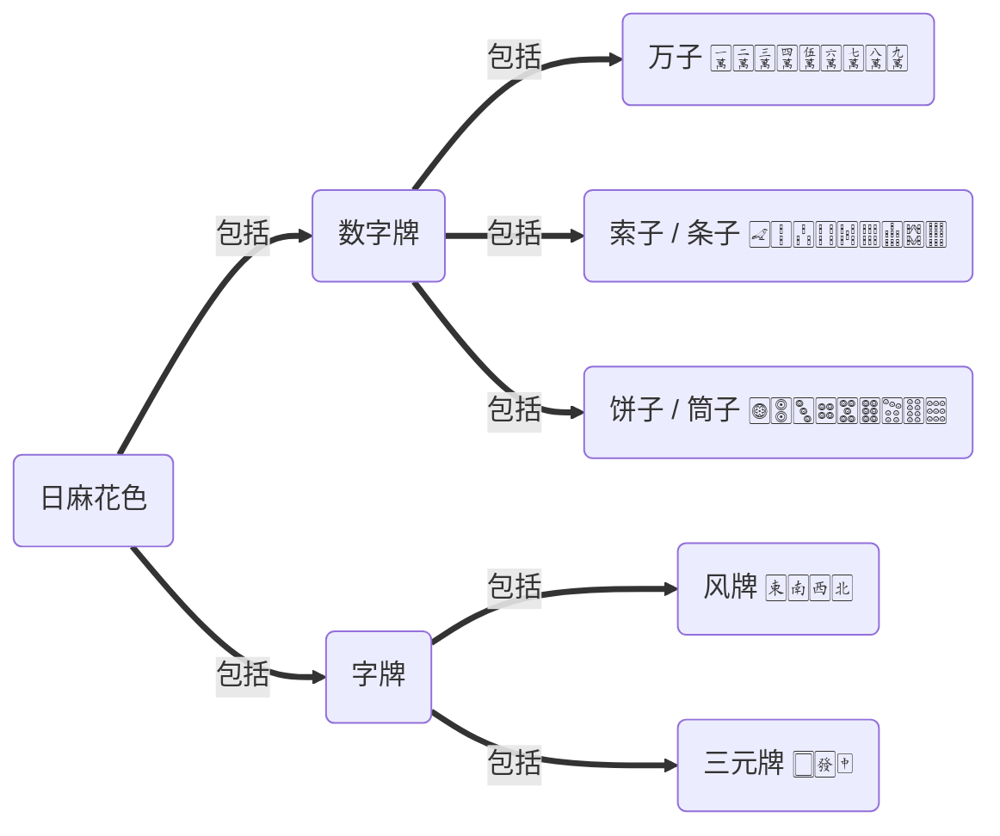
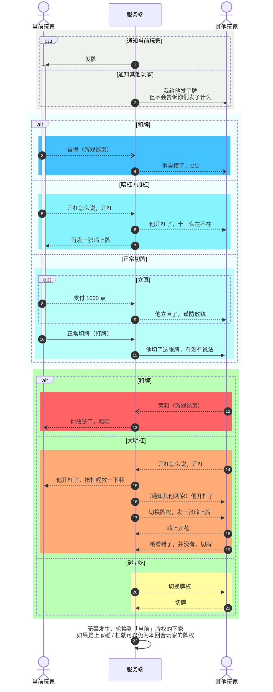

## Prototype 原型

<span class="sticker">
    <a href="https://github.com/time2beat/mahjong-game/tree/prototype" target="_blank"></a>
    
    <a href="https://github.com/time2beat/mahjong-game/releases/tag/v0.0.1-alpha-3c" target="_blank"></a>
</span>

## Godot 重置版

详见《<a href="/tech/game-mahjong-fact-gdd" target="_blank">日麻游戏〈雀实〉游戏设计文档</a>》。

## Reference 参考资料

- 「[麻将 - 维基百科](https://en.wikipedia.org/wiki/Mahjong)」规则参考、变量 / 函数命名参考
- 「[麻雀 和了判定（役の判定） アルゴリズム](http://hp.vector.co.jp/authors/VA046927/mjscore/mjalgorism.html)」和牌判定算法参考
- 「[麻雀の数学](http://www10.plala.or.jp/rascalhp/mjmath.htm)」相关数学概念认知
- 「[麻雀の役一覧（出現確率ランキング順）](http://www2.odn.ne.jp/~cbm15900/html/y99.html)」相关数学概念认知补充
- 「[天鳳 | 最高峰の対戦麻雀サイト](https://tenhou.net/)」流程设计参考
- 「[4chan /mjg/ Repository](https://repo.riichi.moe/)」麻将相关的各种资料 / 资源
-  各种语言的棋牌相关算法
-  [HTML5 在线日麻](https://kobalab.net/majiang/)（交互参考）
-  日麻相关 Python 库
-  日麻助手（计算牌效，支持天凤 / 雀魂，AI 算法参考）
-  [天凤 / 雀魂复盘工具](https://akochan.ekyu.moe/)
-  雀魂牌谱分析工具
-  雀魂加强版客户端

## Design 需求整理 / 项目设计

### 配牌生成



那么一局总共有 $ \left( 9 \times 3 + 7 \right) \times 4 = 136 $ 张麻将牌（日麻没有季节牌和花牌）。\
除开 4 家的起手手牌和 7 墩王牌还剩 $ 136 - \left( 13 \times 4 + 1 \right) - \left( 2 \times 7 \right) = 69 $ 张山牌。\
每局牌序确定之后，各家手牌和王牌（ / 、 / 、、）就都确定了。

> 杠完海底也会变，岭上交给开杠玩家，上一张海底推入王牌，保证王牌始终有 14 张。\
> 详见《[日麻“王牌”的简单知识——海底、宝牌指示、岭上三者关系](https://bbs.nga.cn/read.php?tid=16056906)》一帖或者下一节。

### 王牌计算

```goat
                  | |                                           |
------ 山 牌 -------| |------------------- 王 牌 -------------------|
                  | |------------ 宝 牌 ------------| |--- 岭 上 ---|
                  | |                             | |           |

+-----+-----+-----+ +-----+-----+-----+-----+-----+ +-----+-----+
|     | 预 备 | 预 备 | |     |     |     |     |     | |     |     |
|     | 海 底 | 海 底 | | 杠 宝 | 杠 宝 | 杠 宝 | 杠 宝 | 宝 牌 | | 岭 上 | 岭 上 |
|     | 3   | 1   | | 4   | 3   | 2   | 1   |     | | 3   | 1   |
+-----+-----+-----+ +-----+-----+-----+-----+-----+ +-----+-----+
| 预 备 | 预 备 | 默 认 | | 杠   | 杠   | 杠   | 杠   | 里   | |     |     |
| 海 底 | 海 底 | 海 底 | | 里 宝 | 里 宝 | 里 宝 | 里 宝 | 宝 牌 | | 岭 上 | 岭 上 |
| 4   | 2   |     | | D   | C   | B   | A   |     | | 4   | 2   |
+-----+-----+-----+ +-----+-----+-----+-----+-----+ +-----+-----+

------------------------------------ 开 杠 ------------------------------------

+-----+-----+-----+                                         +-----+    ^ 拿 走
|     | 预 备 | 新 的 |    暗     暗     暗     亮                  |     |    |
|     | 海 底 | 海 底 | +-----+-----+-----+-----+-----+ +-----+ | 岭 上 | --'
|     | 3   |     | |     |     |     |     |     | |     | | 1   |
+-----+-----+-----+ | 杠 宝 | 杠 宝 | 杠 宝 | 杠 宝 | 宝 牌 | | 岭 上 | +-----+
| 预 备 | 预 备 |       | 4   | 3   | 2   | 1   |     | | 3   |
| 海 底 | 海 底 | +-----+-----+-----+-----+-----+-----+ +-----+-----+
| 4   | 2   | | 推 入 | 杠   | 杠   | 杠   | 杠   | 杠   | |     |     |
+-----+-----+ | 王 牌 | 里 宝 | 里 宝 | 里 宝 | 里 宝 | 宝 牌 | | 岭 上 | 岭 上 |
              |     | D   | C   | B   | A   |     | | 4   | 2   |
              +-----+-----+-----+-----+-----+-----+ +-----+-----+

---------------------------------- 四 杠 之 后 ----------------------------------

                       亮     亮     亮     亮     <--- 四 墩 杠 宝 全 亮
+-----+ +-----+-----+-----+-----+-----+-----+-----+
|     | | 预 备 | 预 备 |     |     |     |     |     |
|     | | 海 底 | 海 底 | 杠 宝 | 杠 宝 | 杠 宝 | 杠 宝 | 宝 牌 |
|     | | 3   | 1   | 4   | 3   | 2   | 1   |     |
+-----+ +-----+-----+-----+-----+-----+-----+-----+
| 最 后 | | 预 备 | 原   | 杠   | 杠   | 杠   | 杠   | 里   |
| 一 张 | | 海 底 | 最 初 | 里 宝 | 里 宝 | 里 宝 | 里 宝 | 宝 牌 | <--- 不 过 立 直 才 会 结 算 里 宝
| 海 底 | | 2   | 海 底 | D   | C   | B   | A   |     |
+-----+ +-----+-----+-----+-----+-----+-----+-----+
```

> 四杠之后再杠呢？视为流局，「四杠散了」。

不过这里有一个问题，那就是岭上的逆向问题。\
首先想象一排牌山：

```goat
+-----+-----+-----+-----+-----+-----+-----+-----+
|     |     |     |     |     |     |     |     |
| … … | … … | 1   | 3   | 5   | 7   | … … | … … |
|     |     |     |     |     |     |     |     |
+-----+-----+-----+-----+-----+-----+-----+-----+
|     |     |     |     |     |     |     |     |
| … … | … … | 2   | 4   | 6   | 8   | … … | … … |
|     |     |     |     |     |     |     |     |
+-----+-----+-----+-----+-----+-----+-----+-----+
```

按摸牌顺序依次应该是：1、2、3、4、5、6、7、8……这样排对吧？这个没问题。\
可是倒过来呢？

按照岭上牌的反向摸法，应该是：7、8、5、6、3、4、1、2……对吧？\
而雀魂却是直接简单粗暴地倒序排列：8、7、6、5、4、3、2、1……与现实逻辑是相悖的。

我是最开始的时候写（仿真的）发牌函数的时候发现这个问题的。\
不过这是个小问题，如果我乐意，把最前面四张当作岭上都行，反正游戏里砌牌摸牌又不用玩家完成。牌山只要定下来，配牌的具体**规则**也定下来**不变**，怎么发都是一个效果，无伤大雅。\
你把牌序当成洗出来就是那样不就行了？

### 梳理主要游戏流程

1. 标准 136 张，洗牌 shuffle 洗成乱序。
2. 从庄家开始轮流摸 4，各摸三轮后，庄家跳 2，闲家各跳 1。
3. 起手完毕，翻开第 1 张宝牌指示器（倒第 5 张）。
4. 庄家打出第一张牌，正常轮流摸切：



<details class="collapse">
  <summary>文字描述</summary>

1. 摸牌阶段（Draw Phase）：摸一张牌（山牌已空，无牌可摸，荒牌流局）
2. 准备阶段（Standby Phase）：
   1. 判定能否和牌
   2. 判定能否开杠（暗杠 / 加杠）
   3. 判定能否立直
   4. 允许什么都不做，直接切牌（打牌）
3. 主要阶段 1（Main Phase 1）：开始倒计时，等待玩家选择
   1. 和牌：自摸，本局游戏结束
   2. 暗杠 / 加杠：判定十三么抢杠，若没有，则回到摸牌阶段（摸岭上牌）
   3. 立直 / 正常切牌：打出一张牌
4. ~~战斗~~ 阶段（Battle Phase）：舍张交给别家判定，等待玩家选择
   1. 下家：和 / 杠 / 碰 / 吃\
      对家 / 上家：和 / 杠 / 碰
   2. 和 > 杠 / 碰 > 吃，依次顺延等待玩家做出选择后开始裁定（抢杠等）\
      （优先级：有人选择和牌就不用再等另一个人纠结杠不杠了，碰抢吃同理）
5. 主要阶段 2（Main Phase 2）:
   1. 和牌：荣和，本局游戏结束
   2. 大明杠：切换到开杠玩家，进行他的摸牌阶段（摸岭上牌）
   3. 碰：切换到碰的玩家，进行他的主要阶段 1
   4. 吃：切换到下家，进行他的主要阶段 1
   5. 无事发生，进入下个阶段（回合结束）
6. 结束阶段（End Phase）：切换到下一顺位的玩家，从摸牌阶段重新开始

> 游戏刚开始是庄家的回合，从准备阶段开始。\
> 此时所有人过一个「九种九牌」的流局判定。

</details>

### 数据结构

如何生成配牌
: 最公平的方法自然是当作真的有那 136 张麻将牌，然后用公平洗牌算法打乱顺序。
: 如何实现也很简单，枚举每一张牌就行了。
: 而且还能完美兼容赤宝牌。（因为相当于每一张牌都有了自己的「身份证」）

如何枚举每一张牌（从第 1 张一万到第 4 张红中）
: 最简单的方法是直接按顺序排列枚举值：`0` \~ `135`（天凤就是这么做的）。
: 问题在于这样做会丢失特征：突然给你一个数值，除了拿去查表没有其他办法认出它是谁。
: 现实中也没有说单纯递增 +1 的吧？而是  +  +  + 。
: 所以我决定将项目中麻将牌的「身份证」也照此设计为 3 位：
: 花色（万、饼、索、字）、序号（`1 ~ 9` / `1 ~ 7`）、区别号（`0 ~ 3` 共 4 张）。
: 这样做的好处是一看就知道是哪张牌，代码上也很好处理：花色 `n/100`、序号 `n/10 %10`。
: 为了避免额外处理前导零问题，花色（百位）从 1 到 4，序号（十位）从 1 到 9(7)。
: （而且这样也符合人的直觉逻辑 —— 一就是一，二就是二。）
: 而编号仍然按照代码习惯从 0 到 3 —— 共计 4 位，代表四张同种麻将牌。
: 所有枚举值都是 `100 < n < 500` 的 ，也保证了尽量小的运算量（空间 + 时间）。
: 再说有些语言本来就不支持枚举字符串（`9m/9p/9s/7z`），这个设计也保证了通用性。
: ~~如果语言特性不支持自定义值的枚举类型，那当我没说。~~
: 这个设计还有个好处就是排序手牌变得非常简单，直接按值从小到大 `sort()` 就行了。
: 天然兼容赤宝牌，无需任何额外判断。

如何枚举不同的牌（从一万到红中）
: 在运算过程中还会经常碰到要遍历 34 种不同麻将牌的需求。
: 但这就没必要过度设计了，直接按顺序排成 `0` \~ `33` 即可。
: 实际两个嵌套 `for` 循环 / 加个判定条件就能区分；再者也能贴合数量映射数组的 `index`。
: 键名最好取上一个设计的前两位（花色 + 序号），方便直接获取该值（`n/10`）。
: 如果枚举不支持数字键名就使用组合键名（`KEY_11`），或用常量对象（字典 / ）。

### 核心算法

本来想过换成 Go 来写，编译成动态链接库 `mahjong.dll` 再给 Godot 游戏加载。

> 加载完 `Assembly.LoadFile("mahjong.dll")` 就可以 `GDNative.call_native()` 直接调用。

转念一想，算法都有了，用什么语言又有什么区别呢？

### 向听数计算

[日麻百科（向听数计算）](https://www.bilibili.com/read/cv12887274)

### 序列化与反序列化

反序列化为字符串后会**损失**每一张牌**自己**的具体位置信息，不过牌种位置信息还在。\
比方说 `[152, 153, 150, 151]` 反序列化后就是 `5m0m5m5m`。\
只有特别处理过的  的位置信息还在，别的普通  具体 **一对一** 的位置信息都在转换过程中损失了。重新序列化 `5m0m5m5m` 变成 `[150, 153, 151, 152]`，已经不是原来的序列了。

不过好在实际上对游戏本身 **并没有影响**。\
因为实际游戏过程中是不会关心「一张五万本来是第几张五万」的：\
「我只和上局 **第三张** 打出的 _七饼_，别的 _七饼_ 我不和」这不是有病吗。

> 没有冒犯的意思，事实上强迫症也许真的会这样。我本人就患有严重强迫症，我能理解这种痛苦。

洗牌时枚举每一张进行打乱顺序，是为了保证公平，不会出现意外的偏差（比如避免和上一局的牌序发生某些关联）。洗完之后同一种牌具体的排序就不再重要了，损失掉也没关系，只要保证赤宝牌的位置信息没损失就行了。

另外，以字符串序列化的牌序，同一种牌永远是 `0, 1, 2, 3` 这样排，尾号为 3 的牌永远沉底。\
（字符串序列化后的牌序：尾号为小的牌永远在前面，尾号大的牌永远在后面。）\
只有**特殊**处理，洗完它在哪里它就一直在那里，序列化和反序列化都不会对它产生影响。\
（所以起始手牌可能存在赤宝牌，这是符合事实逻辑的。）

### 关于鸣牌

同时鸣牌如何判定？

- **和牌** 判定最高，可以抢所有鸣牌。（国士无双甚至可以抢暗杠）
- **杠** 和 **碰** 之间不存在冲突。（3 + 2 抢 1 = 有 6 张同种牌是吧？搁这千王之王呢）
- **杠** 和 **碰** 优先级大于 **吃** —— _杠_ / _碰_ 可以抢 _吃_。
- **吃** 只能吃上家，因此也不存在 **吃** 抢 **吃**，同一时间只有一个人有可能吃。
- 因此鸣牌优先级为：和 > 杠 / 碰 > 吃。

鸣牌如何标记？（和牌不需要标记，除非是「血战」玩法）

> 吃只可能吃上家，因此只有 `_ 2 3` / `1 _ 3` / `1 2 _` 吃哪组的问题。

```GDScript
enum { CALL_CHOW, CALL_PONG, CALL_KONG }  # 枚举鸣牌类型
enum { SEAT_NEXT, SEAT_FRONT, SEAT_PREV }  # 枚举各家座次 注意三人麻将没有对家(SEAT_FRONT)

var meld: Dictionary = {  # 副露 示例数据结构
	"type": CALL_CHOW,    # 鸣牌类型
	"have": [],           # 拥有的牌
	"pick": [],           # 捡回的牌
	"from": SEAT_PREV,    # 特殊标记鸣的哪家的牌
}                             # 其实吃不需要特殊标记, 位置信息就足够标识了, 比如 123 213 312
                              # 碰 / 杠才需要, 比如 222 需要标记哪张是碰过来的
```

> 其实 `type`（鸣牌类型）都不需要额外标记，保留只是为了提高容错。
>
> - 判断是否为吃：`int(meld["have"][0] / 10) != int(meld["pick"][0] / 10)`\
>    排除掉「吃」，就不会与「碰」搞混了（两者都是 2 缺 1），其余的类型判断数量就行
> - 判断副露数据格式是否合法：\
>    `[ len(meld["have"]), len(meld["pick"]) ] in [ [2, 1], [2, 2], [3, 1], [4, 0] ]`

|                             吃                             |           碰            |                          加杠                           |                         大明杠                          |                                          暗杠                                           |
| :--------------------------------------------------------: | :---------------------: | :-----------------------------------------------------: | :-----------------------------------------------------: | :-------------------------------------------------------------------------------------: |
|                         吃第 1 张                          |       碰下家 `#1`       |                   碰下家后 `#1` 加杠                    |                       杠下家 `#3`                       |                                         不求人                                          |
|                         吃第 2 张                          |       碰对家 `#2`       |                   碰对家后 `#2` 加杠                    |                       杠对家 `#2`                       |                                                                                         |
|                         吃第 3 张                          |       碰上家 `#3`       |                   碰上家后 `#3` 加杠                    |                       杠上家 `#1`                       |                                                                                         |
| have 2 pick 1<br> | have 2 pick 1<br>repeat | have 2 pick <br>repeat | have  pick 1<br>repeat | have  pick <br>repeat |
|                          `m13-2`                           |        `p50-5_2`        |                       `s55-05_3`                        |                       `m550-5_1`                        |                                         `z7777`                                         |

> 本来 `m550=5#1` 这样更具代表性的符号可读性更强，换成 `-_` 是为了保证 URL 编码后的兼容性。\
> ~~没错，我已经在考虑日后（？你先把手上的活做一点行吗）的网页版了。~~

正则也很简单——`/^([mpsz]{1})(\d{2,4})-?(\d{0,2})_?(\d?)$/ig`（[可视化](<https://jex.im/regulex/#!flags=i&re=%5E(%5Bmpsz%5D%7B1%7D)(%5Cd%7B2%2C4%7D)-%3F(%5Cd%7B0%2C2%7D)_%3F(%5Cd%3F)%24>)）。\
匹配到的四组分别是：花色、拥有的牌（`have`）、捡回的牌（`pick`）、鸣牌目标（`from`）。

> 思考标记鸣牌目标究竟是标记「」还是「」。\
> 相对位置：事中（渲染）方便；下家、对家、上家一目了然。\
> 绝对位置：事后（牌谱）方便；东、南、西、北该是哪家就是哪家。

#### 鸣牌概括字符串格式示例

吃（博客渲染排序错误 当时满脑子都是实现 还没意识到只能吃上家）
: 

```
m78-6 + p68-7 + s67-8
```

碰
: 

```
m11-1_2 + p22-2_1 + s33-3_0
```

加杠（博客渲染暂未实现兼容）
: 

```
m77-77_2 + p88-88_1 + s99-99_0
```

大明杠
: 

```
m055-5_2 + m550-5_1 + m555-0_0
```

暗杠
: 

```
m9999 + z1111 + z6666
```

### 和牌判定

详见《<a href="/tech/game-mahjong-algorithm" target="_blank">麻将和牌判定算法及相关实现</a>》一文。

### 听牌判定

**听牌** 时的手牌数量必定是 $ 3 n + 1 $ 形式。

- 暴力：加上任意一张牌（遍历 34 种）构成 14 张再判断是否能 **和牌**。
- 优雅：剪枝归类。（类似《[日麻听牌判断归类算法](https://www.bilibili.com/read/cv4601162)》）

### 听牌提示

所谓「听牌提示」就是摸切时拿到一张「进张」构成 14 张，此时打出某一张就可以 **听牌**。

- 暴力：将任意一张替换成其他牌（遍历 13 张 × 33 种）再判断是否能 **和牌**。
- 优雅：去掉任意一张判断是否能 **听牌**。

### 网络通信

- 协议：Websocket / WebRTC / Protocol Buffers / RPC(P2P)
- TCP 判断连接状态
- UDP 收发通信数据
- 支持局域网联机

### Todo List

- [ ] 各种玩法：日麻 / 川麻 / 血战……
- [ ] 各种游戏方式：单机 / 联机 / 测试……
- [ ] 考虑移动端：研究《[雀魂](https://www.maj-soul.com/)》《[雀姬](https://www.queji.tw/)》尤其是手机版的输入行为判定逻辑
