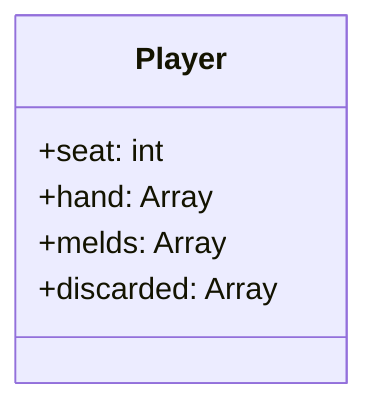

> 思路见《<a href="/tech/game-mahjong-diy/" target="_blank">手写一个日麻游戏</a>》一文。

    
    
     
    
    
    

## Roadmap 路线图

- `v0.1.0-alpha.1` **雏形**\
   能动：可以输入，处理完输入后有反馈，像个游戏的样子
- `v0.1.0-alpha.2` **完善基础设施** \
   能打麻将：可以正常游玩（指获得一局完整的游戏体验）
- `v0.1.0-alpha.3` **完成人机 AI**
  1. [ ] 思考 AI 如何介入游戏：com 玩家数据拥有 AI？还是 AI 拥有 com 玩家数据？
  2. [ ] 会打牌
  3. [ ] 会鸣牌
  4. [ ] 会做牌（保留面子打出散牌，鸣牌根据置信度确定）
- `v0.1.0-alpha.4` **完成整局单人游戏**
  1. [ ] 完成听牌提示功能
  2. [ ] 完善主要 UI
  3. [ ] 自由设置思考倒计时
- `v0.1.0-alpha.5` **完善日麻规则判定**
  1. [ ] 完成立直功能
  2. [ ] 完成振听判定
  3. [ ] 完成流局判定
  4. [ ] 完成役种判定 是否允许和牌（自风 / 场风）
  5. [ ] 完成<a href="/game/mahjong-new/#%E7%82%B9%E6%95%B0%E8%AE%A1%E7%AE%97" target="_blank">点数计算</a>
  6. [ ] 完成连续多局游戏（半庄 / 东南）
- `v0.1.0-alpha.6` **完善人机进阶 AI 策略**
  1. [ ] 不同流派：役牌 / 立直 / 平和 / 断么九
  2. [ ] 优先打闲风（不考虑大牌）
  3. [ ] 优先打绝张（绝张换听）
  4. [ ] 优先留刻子（保碰争杠）
  5. [ ] 优先打边张
  6. [ ] 优先留宝牌

[^md5]:
    这个功能主要是为了证明「游戏内部没有篡改数据」：每局的配牌在一开始就确定了（洗好牌）。\
    使用的 md5 算法理论不可逆，也就防止了根据 hash 后的 md5 码反向破解出配牌顺序。\
    ~~当然你硬要遍历一个彩虹表出来逆向谁也拦不住你是吧。~~\
    彩虹表大小： $ \LARGE{\frac{136!}{4!^{34}}} \approx 4.327 \times 10^{185} $ （[参考](http://www10.plala.or.jp/rascalhp/mjmath.htm#1)）

## Changelog 更新日志

  
<code>v0.1.0-alpha.1a</code> feat: basic ui

- [x] 便于自动排序、且兼容赤宝牌的数据结构设计
- [x] 配牌生成 & 牌序记录
- [x] 序列化（字符串 → 牌序对象）和反序列化（对象 → 牌序字符串）
- [x] md5 验证牌山确保牌序未被篡改（参考[雀姬](https://www.queji.tw/cardsmd5/)）[^md5]
- [x] 基本 UI 交互界面
- [x] 根据牌序计算四家手牌
- [x] 根据牌序计算宝牌指示器（杠宝）、里宝牌（杠里宝）、岭上牌、海底牌
- [x] 发牌 / 打牌 / 摸牌
- [x] 记录摸切历史（进张、舍张记录）
- [x] <kbd>Esc</kbd> 开启 debug 控制台功能（配牌预览 山牌 / 王牌）
- [x] 动态渲染手牌和宝牌指示器
- [x] 鸣牌判定

  
<code>v0.1.0-alpha.1b</code> chore: Auto CI/CD & HANDS/DRAWS enum

- [x] 部署 SSH-Key `ssh-keygen -b 4096 -C "ACTIONS_DEPLOY_KEY" -f actions_deploy_key`
- [x] 找到合适的 action 脚本 
- [x] 修改脚本以适配本项目
- [x] 打通自动部署工作流  由 GitHub Action 自动编译
- [x] 枚举：役种 / 流局类型

  
<code>v0.1.0-alpha.2a</code> feat: basic game frame

- [x] feat: 单元测试 hook
- [x] feat: 优化发牌函数，降低耦合程度：手牌和山牌计算现在最低兼容 2 个玩家\
       （而且不止可以发 13 张，即使发 7 张，各玩家的手牌和山牌也是正确的。）
- [x] feat: 渲染别家手牌信息
- [x] feat: Debug 控制台添加透视功能
- [x] feat: 新增了简单的标题界面和调试界面
- [x] feat: 完成单独的「模拟发牌」调试界面
- [x] feat: 完成单独的「手牌分析」调试界面（目前只有和牌判断，更多功能待补充）
- [x] feat: 完成和牌判定
- [x] feat: 新增了音效（资源来自 [天鳳用オリジナル SE: アンコロキング blog](http://ancoro.way-nifty.com/blog/se.html)）
- [x] style: 更新了图片素材（资源来自 [麻雀の画像・素材 - 来夢来人](https://www.civillink.net/fsozai/majan.html)）
- [x] fix: 更新了牌背的渲染方式：着色器染色 → 直接更换素材帧\
       现在理论上不可能（作弊）**看穿**牌背（因为它本来就是的 **背面** 牌）。\
       ~~以前取消着色器就可以直接透视牌面了。~~
- [x] fix: 重绘了 UI 布局，添加了对局信息：东一局 / 本场数 / 点棒数 / 余牌数 / 各家点数
- [x] fix: 现在可以正确渲染赤宝牌了（以前计算是正确的，但显示为普通五万 / 饼 / 索）

  
<code>v0.1.0-alpha.2b</code> feat: game loop

- [x] feat: 模拟服务端和客户端之间的加密通信
- [ ] feat: 完成鸣牌功能（包括加杠 / 暗杠） 已完成按钮功能和渲染副露区
- [ ] feat: 完成主游戏循环（轮流 turn 摸切）

## Review 反思

  
2022 年 4 月 23 日：各家的舍张记录究竟属于谁

静下来思考的时候发现两个问题。

其一，这个问题是我在思考更好的 AI 引入方式的时候发现的：\
各家**进张**（摸牌）和**舍张**（打牌）的历史记录，不属于玩家，而是**属于这局游戏**。没错，连进张记录也属于游戏；和舍张记录的区别也就只对创造者可见，对其他玩家隐藏罢了。

我本来在想引入 AI 后，是 AI 对象拥有一个完整的玩家数据对象？（`AI` drive `人机玩家`）\
还是玩家数据对象内部嵌入了一个 AI 对象？（`AI` in `人机玩家`）

此时我突然意识到，「每家打了哪些牌」这个信息，并不属于玩家自己，而是整局游戏。\
参与游戏的每个玩家（甚至包括没有参与的旁观者）都能获取这些信息。\
此前我将进张 / 舍张记录放在玩家对象里是非常愚蠢的做法。

其二、我陷入了一个「需要帮助、却下意识拒绝帮助」的思维怪圈。

> 不得不说语言实在是很神奇的东西，有时候微不足道，有时候又雷霆万钧。\
> 甚至不需要说出口（不过说出口的心理增幅作用也很重要），在心里化作成型的语句就够了。

本来我就是随便起了个标题——「**手写**」。我以为自己没有当真，其实潜意识里当真了。\
心里埋下这个种子之后，它在不知不觉中长成了一种执念。\
明明需要进修，却无意中拒绝进修，而是一味钻牛角尖自己闭门造车。

他妈的，动动手指搜索一下解决方案，参考而已，又没让你照抄，真的有那么难吗？\
明明有成熟的算法可以参考，非要自己（宁愿避开）从零开始实现，图个啥呢。

  
2022 年 4 月 27 日：第一次重构

> 稍微回头看了下，写得太随意了，根本没有任何组织性，想到哪里写到哪里。\
> Roadmap 既没有提纲挈领，也基本没有前瞻性，完全就是流水帐。重写重写。

重新设计项目架构：

- 麻将通用基类 `MahjongBase`：麻将相关基础功能
  1. [x] 生成 `new_tile_walls()` 使用公平洗牌算法（打乱顺序）洗好的牌堆
  2. [x] 解析字符串牌面 序列化与反序列化 `serialize()` / `deserialize()` 以便 md5 验证
  3. [x] 根据牌序按人数和游戏方式发放手牌 `deal_tiles()` 并在此基础上计算出山牌
  4. [x] 根据牌序和开杠数量 `get_dora()` 计算对应的宝牌指示 / 里宝 / 岭上 / 海底
  5. [x] 判断一副手牌 `can_win()` 是否能和
  6. [ ] 判断一副手牌 `is_ready()` 是否已经听牌
  7. [ ] 计算一副手牌 `get_shanten()` 的向听数
  8. [ ] 评估一副手牌 `estimate_hand_value()` 的得分（符数、翻数、役种、基本点数）
- 麻将游戏类 `MahjongGame`：麻将游戏所需功能
  1. [ ] 生成（记录）牌谱
- 麻将游戏 Server 服务端 `BoardHost`：游戏主持人，负责裁定\
   （联机则把这部分放到云端）
  1. [ ] ：手牌、山牌、宝牌、余牌、荒牌流局、摸切记录、鸣牌记录
  2. [ ] 记录：场风、本场数、点棒（立直）数、座位（自风）、点数
- 麻将游戏 Client 客户端 `PlaySpace`：用户接口（UI）提供交互
  1. [x] 读取已知牌谱，并进行渲染
  2. [x] 接受用户输入（玩家操作）
  3. [x] 排序手牌
  4. [ ] 听牌提示

  
2022 年 4 月 27 日：玩家对象是一组数据还是一个实例

玩家根本就不该是一个类。

玩家不是一个实例，不该有自己的方法，它就是一组数据，高度模式化的数据。

Player 顶多有 `seat` / `hand` / `melds` / `discarded` 四个属性，没了。\
它不会有摸牌，打牌，鸣牌等「行为」。我之前做了行为不说，甚至还把「进张记录」保存在玩家类里，美其名曰「面向对象」，简直离谱。

本意是用四个数组就把牌谱记得明明白白，出发点是好的，可这反而拘束了我。\
写一个牌谱类用来专门记录牌谱，有那么麻烦吗？\
你要是真的有**那么**追求极简，你咋不用机器码编程呢？

这就是提前写一遍原型带来的坏处了，确实提前趟平了许多坑，但同时也带来了思维定势。\
另外我主观上也有锅，以前没怎么写过游戏，导致写起来很多时候还是面向过程的想法，而不是纯粹的面向对象。

这一点想通全都通了。

1. 服务端开房间，玩家连接进来，开始游戏。
2. 服务端生成配牌，md5 通知客户端。开局，把起始手牌发给玩家，没了。
3. 开始正常游戏循环。所谓正常游戏循环，就是服务端处理完，问客户端要输入，`yield`，等到客户端响应输入或者超时判定为掉线，继续处理，下一个循环。
4. 每次有更新（摸牌，打牌，鸣牌）把更新的数据发给客户端，作为通知。
5. 所有判断都归服务端，客户端只负责渲染接收到的数据，以及在需要时询问用户输入。
6. 服务端需要输入，就发请求给客户端，客户端限时回应，过时不候。
7. 打个麻将而已，所谓的通信就是这样了，能有多复杂？\
   打个麻将还考虑把运算量放在客户端来优化是不是想太多？\
   我可能对 2022 年的计算机算力有一些误解。

  
2022 年 4 月 29 日：第二次重构

做技术验证的时候老毛病犯了：沉迷造轮子。\
写得时候开心得不行，完全是不顾一切，直接沉溺进去了。\
做完了完整的三次握手通信 + AES 加密解密数据包，然后发现 Godot 有封装好的现成实现。

心态当时就崩了，甚至起了弃坑的念头。\
冷静下来反思，这他妈不是你自己的问题吗，假装做了架构设计，其实有个锤子设计。\
就是东一榔头西一棒槌；想到哪里 —— 最多写下来记录一下 —— 然后就兴冲冲地去做，跟没有设计有啥区别。

重画了 UML 类图，图太大这里放不下，开了个 <a href="/pages/mahjong-fact-class_diagram.html" target="_blank">单页</a>。

